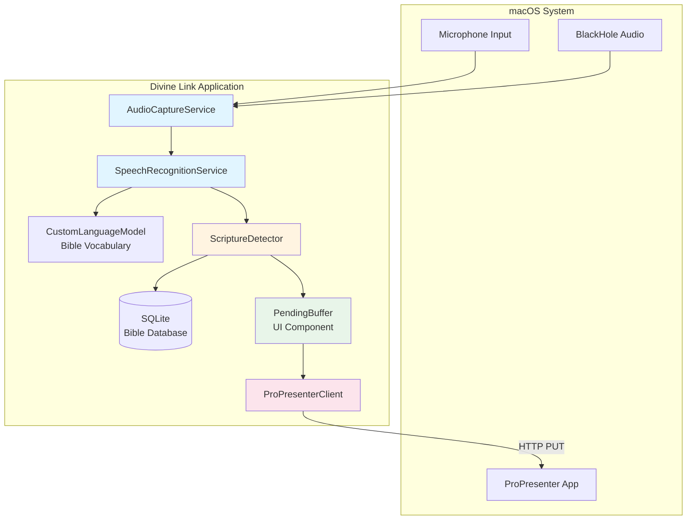
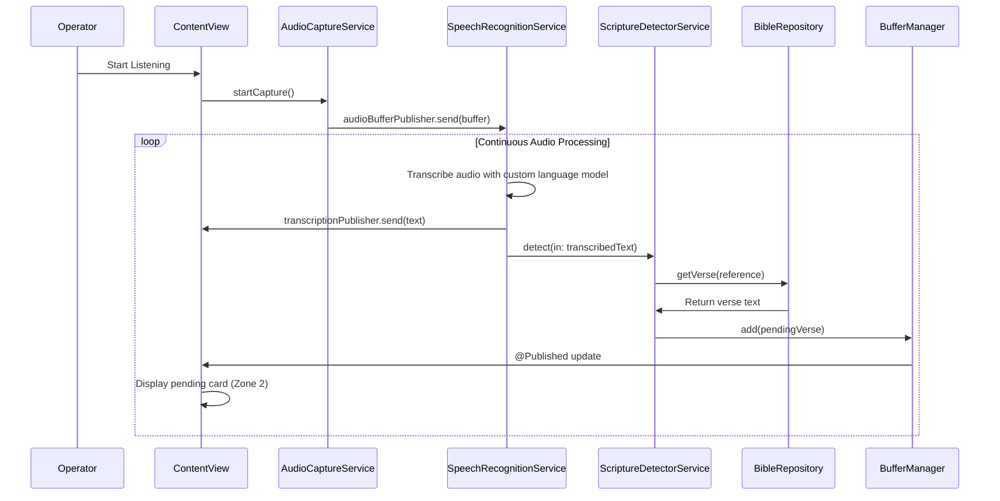
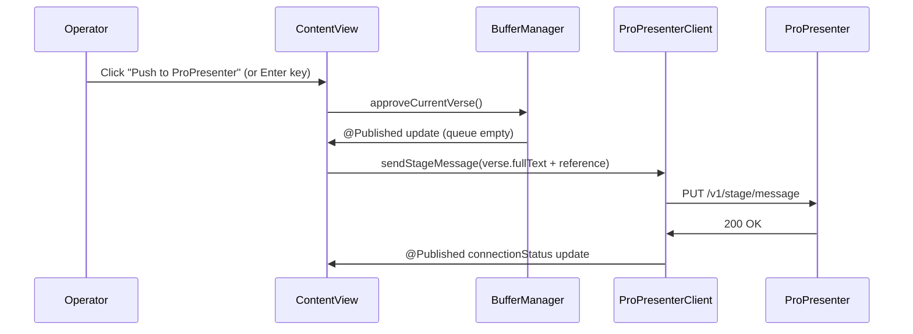

# Divine Link - Fullstack Architecture Document

**Document Type:** Architecture Document  
**Version:** 1.0  
**Date:** January 2026  
**Author:** Winston (BMAD Architect)  
**Status:** Approved for Development

---

## Change Log

| Date | Version | Description | Author |
|------|---------|-------------|--------|
| January 2026 | 1.0 | Initial architecture document | Winston (Architect) |

---

## 1. Introduction

This document outlines the complete fullstack architecture for Divine Link, a macOS native application for real-time scripture detection and ProPresenter integration. It covers the application architecture, system components, data flow, and technical implementation details to guide development.

Divine Link uses a local-first approach with Apple's native Speech framework for sub-second latency and zero variable costs. The architecture integrates audio capture, speech recognition, scripture detection, and ProPresenter API communication within a single macOS application.

**Note:** This is a native macOS application, not a traditional web fullstack. All processing happens on-device with no backend infrastructure required.

---

## 2. High Level Architecture

### 2.1 Technical Summary

Divine Link is a native macOS application built with Swift and SwiftUI, using a local-first architecture. All processing runs on-device: audio capture via AVAudioEngine, speech recognition via SFSpeechRecognizer with custom vocabulary biasing, scripture detection through pattern matching, and ProPresenter integration via HTTP API calls. There is no backend infrastructure—the app operates entirely on the user's Mac, achieving sub-second latency and zero variable costs. The architecture follows a modular feature-based structure within a single Xcode project, with SQLite (via GRDB.swift) for local Bible text storage and URLSession for ProPresenter API communication. This design meets PRD goals by eliminating cloud dependencies, ensuring privacy, and maintaining the human-in-the-loop workflow through a clear separation between detection (background) and approval (UI) layers.

### 2.2 Platform and Infrastructure Choice

**Platform:** macOS 14.0+ (Sonoma)  
**Key Services:** None (local processing only)  
**Deployment Host:** Direct download via website/CDN (future: App Store)  
**Regions:** N/A (local app)

**Rationale:** The PRD explicitly targets zero variable costs and local-first processing. No backend services are needed since all processing happens on-device. Distribution via signed DMG is standard for macOS apps outside the App Store.

### 2.3 Repository Structure

**Structure:** Monorepo (single Xcode project)  
**Monorepo Tool:** Xcode Workspace/Project (native Swift tooling)  
**Package Organization:** Feature-based modules within single app target

```
divine-link/
├── DivineLink/                      # Main app target
│   ├── App/                         # App entry point
│   │   ├── DivineLinkApp.swift      # @main entry
│   │   └── ContentView.swift        # Root view
│   ├── Features/                    # Feature modules
│   │   ├── AudioCapture/            # Audio input handling
│   │   ├── Transcription/           # Speech recognition
│   │   ├── Detection/               # Scripture parsing
│   │   ├── PendingBuffer/            # UI for pending verses
│   │   └── ProPresenter/            # PP API client
│   ├── Core/                        # Shared utilities
│   ├── Models/                      # Data models
│   └── Resources/                   # Assets, Bible.db
├── DivineLink.xcodeproj
├── Tests/
├── docs/
└── scripts/
```

### 2.4 High Level Architecture Diagram



### 2.5 Architectural Patterns

- **MVVM (Model-View-ViewModel):** SwiftUI views observe ViewModels; ViewModels manage business logic and state. Rationale: Aligns with SwiftUI's declarative model and Combine for reactive updates.
- **Service Layer Pattern:** Feature-specific services (AudioCaptureService, SpeechRecognitionService, etc.) encapsulate functionality. Rationale: Separation of concerns, testability, and clear boundaries.
- **Repository Pattern:** Data access abstracted through repositories (e.g., BibleRepository wrapping GRDB). Rationale: Enables testing with mock data and future database changes.
- **Observer Pattern:** Combine publishers/subscribers for state changes (e.g., detection events → UI updates). Rationale: Reactive data flow fits SwiftUI and async operations.
- **Factory Pattern:** Service factories for dependency injection (e.g., creating SpeechRecognitionService with custom language model). Rationale: Testability and flexible configuration.
- **Command Pattern:** User actions (Push, Ignore, Pause) as commands. Rationale: Encapsulates actions and supports undo/redo (future).
- **Singleton Pattern (Limited):** App-wide services (e.g., ProPresenterClient) as singletons. Rationale: Single connection instance; use sparingly.

---

## 3. Tech Stack

| Category | Technology | Version | Purpose | Rationale |
|----------|------------|---------|---------|-----------|
| **Language** | Swift | 5.9+ | Core application language | Modern, type-safe, async/await support, native macOS performance |
| **UI Framework** | SwiftUI | Latest (macOS 14.0+) | Declarative UI framework | Native macOS UI, rapid development, reactive updates with Combine |
| **State Management** | Combine | Built-in | Reactive data flow | Native Swift framework, integrates seamlessly with SwiftUI |
| **Audio Capture** | AVAudioEngine | Built-in | Low-latency audio input | Native macOS framework, supports multiple input sources |
| **Speech Recognition** | SFSpeechRecognizer | Built-in | On-device speech-to-text | Local processing, zero API costs, supports custom vocabulary |
| **Language Model** | SFCustomLanguageModelData | Built-in | Bible vocabulary biasing | Biases recognition toward Bible book names and theological terms |
| **Database** | SQLite | 3.x | Local Bible text storage | Lightweight, ships with macOS, no external dependencies |
| **Database ORM** | GRDB.swift | Latest | SQLite wrapper | Type-safe, Swift-native, excellent performance |
| **Networking** | URLSession | Built-in | ProPresenter API calls | Native async/await support, no third-party dependencies |
| **Settings Storage** | UserDefaults | Built-in | App preferences | Simple key-value storage, sufficient for MVP |
| **Auto-Updates** | Sparkle | Latest | Application updates | Industry standard for macOS apps outside App Store |
| **Build System** | Xcode | 15+ | IDE and build tool | Native macOS development environment |
| **Package Manager** | Swift Package Manager | Built-in | Dependency management | Native Swift tooling, integrated with Xcode |
| **Unit Testing** | XCTest | Built-in | Unit and integration tests | Native testing framework, integrated with Xcode |
| **UI Testing** | XCUITest | Built-in | UI automation tests | Native macOS UI testing (future) |
| **Code Signing** | Developer ID | Required | App notarisation | Required for distribution outside App Store |
| **Distribution** | DMG | N/A | Application packaging | Standard macOS distribution format |

---

## 4. Data Models

### 4.1 ScriptureReference

**Purpose:** Represents a detected Bible reference (book, chapter, verse range) with metadata about the detection confidence and original matched text.

**Swift Struct:**

```swift
struct ScriptureReference: Identifiable, Equatable {
    let id = UUID()
    let book: String
    let chapter: Int
    let verseStart: Int
    let verseEnd: Int?
    let rawMatch: String
    let confidence: Float
    
    var displayReference: String {
        if let end = verseEnd, end != verseStart {
            return "\(book) \(chapter):\(verseStart)-\(end)"
        } else {
            return "\(book) \(chapter):\(verseStart)"
        }
    }
}
```

### 4.2 PendingVerse

**Purpose:** Represents a detected scripture verse that is pending operator approval before being pushed to ProPresenter.

**Swift Struct:**

```swift
struct PendingVerse: Identifiable, Equatable {
    let id: UUID
    let reference: ScriptureReference
    let fullText: String
    let translation: String
    let timestamp: Date
    let confidence: Float
}
```

### 4.3 ProPresenterSettings

**Purpose:** Manages ProPresenter connection configuration (IP address, port) and connection status, persisted in UserDefaults.

**Swift Class:**

```swift
class ProPresenterSettings: ObservableObject {
    @Published var ipAddress: String
    @Published var port: Int
    @Published var connectionStatus: ConnectionStatus = .unknown
    
    var isValid: Bool {
        isValidIPAddress(ipAddress) && port > 0 && port < 65536
    }
    
    var connectionURL: URL? {
        URL(string: "http://\(ipAddress):\(port)")
    }
}
```

### 4.4 ConnectionStatus

**Purpose:** Enum representing the state of ProPresenter connection for UI display.

**Swift Enum:**

```swift
enum ConnectionStatus {
    case unknown
    case testing
    case connected
    case disconnected
    case error(String)
}
```

### 4.5 AudioInputSettings

**Purpose:** Manages audio input device selection and preferences.

**Swift Struct:**

```swift
struct AudioInputSettings: Codable {
    var selectedDeviceUID: String?
    var preferredInputType: AudioInputType
    
    enum AudioInputType: String, Codable {
        case microphone
        case systemAudio
        case professional
    }
}
```

---

## 5. API Specification

### 5.1 ProPresenter API Integration

**API Style:** REST (HTTP)  
**Base URL:** `http://{ipAddress}:{port}` (user-configured, default: `http://192.168.1.100:1025`)  
**Protocol:** HTTP/1.1  
**Content-Type:** `application/json`

#### 5.1.1 Send Stage Message

**Endpoint:** `PUT /v1/stage/message`  
**Purpose:** Send scripture text to ProPresenter stage display in real-time

**Request Body:** JSON-encoded string
```json
"And we know that in all things God works for the good of those who love him, who have been called according to his purpose.\nRomans 8:28"
```

**Response:** `200 OK`

**Error Responses:**
- `400 Bad Request` - Invalid message format
- `404 Not Found` - ProPresenter not running or API disabled
- `500 Internal Server Error` - ProPresenter error

#### 5.1.2 Get Current Stage Message

**Endpoint:** `GET /v1/stage/message`  
**Purpose:** Health check and connection testing

---

## 6. Components

### 6.1 AudioCaptureService

**Responsibility:** Captures audio from selected input device and provides audio buffers to the speech recognition service.

**Key Interfaces:**
- `func startCapture() throws`
- `func stopCapture()`
- `func selectDevice(_ device: AVCaptureDevice)`
- `var audioLevel: Float { get }`
- `var audioBufferPublisher: AnyPublisher<AVAudioPCMBuffer, Never>`

**Technology Stack:** Swift, AVAudioEngine, AVFoundation, Combine

### 6.2 SpeechRecognitionService

**Responsibility:** Converts audio to text using Apple's Speech framework with custom vocabulary biasing.

**Key Interfaces:**
- `func startRecognition() throws`
- `func stopRecognition()`
- `var transcriptionPublisher: AnyPublisher<String, Never>`
- `func updateLanguageModel(_ model: SFCustomLanguageModelData)`

**Technology Stack:** Swift, SFSpeechRecognizer, SFCustomLanguageModelData, Combine

### 6.3 ScriptureDetectorService

**Responsibility:** Analyzes transcribed text to detect Bible references using pattern matching.

**Key Interfaces:**
- `func detect(in text: String) -> [ScriptureReference]`
- `func validateReference(_ reference: ScriptureReference) -> Bool`

**Technology Stack:** Swift, NSRegularExpression, Foundation

### 6.4 BibleRepository

**Responsibility:** Provides access to Bible text stored in SQLite database.

**Key Interfaces:**
- `func getVerse(reference: ScriptureReference) throws -> String?`
- `func getVerses(reference: ScriptureReference) throws -> [String]`

**Technology Stack:** Swift, GRDB.swift, SQLite

### 6.5 BufferManager

**Responsibility:** Manages queue of pending scripture detections awaiting operator approval.

**Key Interfaces:**
- `func add(_ verse: PendingVerse)`
- `func removeFirst() -> PendingVerse?`
- `func clear()`
- `var currentVerse: PendingVerse? { get }`

**Technology Stack:** Swift, Combine, Foundation

### 6.6 ProPresenterClient

**Responsibility:** Manages connection to ProPresenter and sends stage messages via HTTP API.

**Key Interfaces:**
- `func configure(baseURL: URL)`
- `func testConnection(to url: URL) async throws -> Bool`
- `func sendStageMessage(_ message: String) async throws`
- `var connectionStatus: ConnectionStatus { get }`

**Technology Stack:** Swift, URLSession, async/await, Combine

### 6.7 UI Components (SwiftUI Views)

**Responsibility:** Present user interface following the "mission control" design philosophy.

**Key Components:**
- `DivineLinkApp` - Main app entry point
- `ContentView` - Root view with three-zone layout
- `ListeningFeedView` - Zone 1: Live transcription display
- `PendingScriptureCard` - Zone 2: Pending verse card
- `ActionButtonsView` - Zone 3: Push/Ignore/Pause buttons
- `SettingsView` - Settings window with tabs

**Technology Stack:** Swift, SwiftUI, Combine

---

## 7. External APIs

### 7.1 ProPresenter Network API

- **Purpose:** Send detected scripture verses to ProPresenter for display on stage screens
- **Documentation:** ProPresenter API documentation accessible via Settings → Network → API Documentation (local to ProPresenter installation)
- **Base URL(s):** `http://{user-configured-ip}:{user-configured-port}` (default: `http://192.168.1.100:1025`)
- **Authentication:** None required (local network only)
- **Rate Limits:** None documented (local network, low-frequency usage)

**Key Endpoints Used:**
- `PUT /v1/stage/message` - Send scripture text to stage display
- `GET /v1/stage/message` - Health check and connection testing

### 7.2 HelloAO Bible API (Future)

**Note:** Not used in MVP. Listed for future reference.

- **Purpose:** Access to additional Bible translations
- **Documentation:** https://bible.helloao.org
- **Base URL(s):** `https://bible.helloao.org`
- **Authentication:** None (public API)
- **Rate Limits:** Not documented (MIT license, public domain)

**Status:** Deferred to post-MVP. MVP uses bundled SQLite database with Berean Standard Bible.

---

## 8. Core Workflows

### 8.1 Scripture Detection and Approval Workflow



### 8.2 Push to ProPresenter Workflow



---

## 9. Database Schema

### 9.1 Database Overview

**Database Type:** SQLite 3.x  
**Database File:** `Bible.db` (bundled in app Resources)  
**ORM:** GRDB.swift  
**Purpose:** Store Berean Standard Bible text for local verse lookup

### 9.2 Schema Definition

#### Books Table

```sql
CREATE TABLE books (
    id INTEGER PRIMARY KEY,
    name TEXT NOT NULL,
    aliases TEXT,
    testament TEXT NOT NULL,
    chapters INTEGER NOT NULL,
    book_order INTEGER NOT NULL
);

CREATE INDEX idx_books_name ON books(name);
CREATE INDEX idx_books_order ON books(book_order);
```

#### Verses Table

```sql
CREATE TABLE verses (
    id INTEGER PRIMARY KEY AUTOINCREMENT,
    book_id INTEGER NOT NULL,
    chapter INTEGER NOT NULL,
    verse INTEGER NOT NULL,
    text TEXT NOT NULL,
    FOREIGN KEY (book_id) REFERENCES books(id) ON DELETE CASCADE
);

CREATE INDEX idx_verses_lookup ON verses(book_id, chapter, verse);
CREATE INDEX idx_verses_chapter ON verses(book_id, chapter);
```

### 9.3 Multi-Translation Architecture

**Design Decision:** Support multiple Bible translations with BSB as default, HelloAO API for additional translations, and custom source support.

**Translation Metadata Table:**

```sql
CREATE TABLE translations (
    id INTEGER PRIMARY KEY AUTOINCREMENT,
    code TEXT NOT NULL UNIQUE,
    name TEXT NOT NULL,
    source_type TEXT NOT NULL,
    source_path TEXT,
    is_default INTEGER DEFAULT 0,
    is_active INTEGER DEFAULT 1,
    downloaded_at INTEGER,
    UNIQUE(code)
);
```

**MVP Scope:**
- ✅ BSB bundled (primary)
- ✅ HelloAO API integration (built-in, on-demand)
- ⏳ Translation management UI (v1.1)
- ⏳ Custom source import (v1.2)

---

## 10. Unified Project Structure

```
divine-link/
├── DivineLink/                          # Main app target
│   ├── App/                             # Application entry point
│   │   ├── DivineLinkApp.swift
│   │   └── ContentView.swift
│   ├── Features/                        # Feature-based modules
│   │   ├── AudioCapture/
│   │   ├── Transcription/
│   │   ├── Detection/
│   │   ├── PendingBuffer/
│   │   ├── ProPresenter/
│   │   └── Bible/
│   ├── Core/                            # Shared utilities
│   ├── Models/                          # Data models
│   └── Resources/                       # App resources
│       ├── Assets.xcassets
│       └── Bible.db
├── DivineLinkTests/                     # Unit tests
├── DivineLink.xcodeproj
├── docs/
└── scripts/
```

---

## 11. Development Workflow

### 11.1 Prerequisites

- macOS 14.0 (Sonoma) or later
- Xcode 15.0 or later
- Swift 5.9 or later (included with Xcode)

### 11.2 Development Commands

**Xcode Commands:**
- Build: ⌘B
- Run: ⌘R
- Test: ⌘U
- Clean: ⌘⇧K

### 11.3 Environment Configuration

**No Environment Variables Required (MVP)**

Since Divine Link is a local-first application with no cloud services:
- No API keys needed
- No environment-specific configuration
- Settings stored in UserDefaults

---

## 12. Deployment Architecture

### 12.1 Deployment Strategy

**Application Distribution:**
- **Platform:** macOS (direct download)
- **Build Command:** Xcode Archive (Product → Archive)
- **Output Format:** Signed DMG (Disk Image)
- **Distribution Method:** Direct download from website/CDN

**Build Process:**
1. Archive in Xcode
2. Export as "Developer ID" signed app
3. Create DMG
4. Notarise with Apple
5. Distribute via website/CDN

### 12.2 Environments

| Environment | Purpose | Distribution Method |
|-------------|---------|---------------------|
| **Development** | Local development | Run from Xcode (⌘R) |
| **Beta** | Internal testing | Signed DMG (not notarised) |
| **Release** | Public distribution | Signed + Notarised DMG |

---

## 13. Security and Performance

### 13.1 Security Requirements

**macOS App Security:**
- **Code Signing:** Developer ID certificate required
- **Notarisation:** Apple notarisation for distribution
- **Data Security:** UserDefaults for settings (non-sensitive)
- **Network:** HTTPS only for HelloAO API calls
- **Privacy:** No analytics, no cloud sync, no user accounts

### 13.2 Performance Optimization

**Target Metrics:**
- **Startup Time:** <2 seconds
- **Detection Latency:** <1 second from speech to pending buffer
- **Memory Usage:** <500MB RAM
- **CPU Usage:** <20% on Apple Silicon

**Optimization Strategies:**
- Lazy loading of Bible database
- Background processing for speech recognition
- Efficient indexed SQLite lookups
- Combine publishers for reactive updates

---

## 14. Testing Strategy

### 14.1 Testing Pyramid

- **Unit Tests:** 70% (business logic, services)
- **Integration Tests:** 20% (component interactions)
- **E2E Tests:** 10% (full user journeys)

### 14.2 Test Organization

**Unit Tests (`DivineLinkTests/`):**
- AudioCaptureTests
- DetectionTests
- BibleServiceTests
- ProPresenterTests

**Integration Tests:**
- Audio → Transcription → Detection pipeline
- Detection → Bible lookup → Buffer flow
- Buffer → ProPresenter push flow

---

## 15. Coding Standards

### 15.1 Critical Swift Rules

- **Naming:** PascalCase for types, camelCase for variables/functions
- **File Organization:** One type per file
- **Error Handling:** Use `throws` and `Result` types
- **Async/Await:** Use async/await for network calls
- **Combine:** Use `@Published` for ObservableObject properties
- **Dependency Injection:** Services injected via initializers
- **Testing:** All public methods must have unit tests

### 15.2 Project-Specific Rules

- **Bible References:** Always use `ScriptureReference` struct
- **Settings:** Use `UserDefaults` via settings classes
- **Network:** All ProPresenter calls via `ProPresenterClient`
- **Audio:** All audio operations via `AudioCaptureService`
- **Database:** All Bible queries via `BibleTextService`

---

## 16. Future Enhancements

### 16.1 Post-MVP Features

**v1.1:**
- Translation selection UI
- HelloAO API integration for additional translations
- Custom translation import

**v1.2:**
- App Store distribution
- Bundled BlackHole (with commercial license)
- Cloud ASR fallback (Whisper API)

**v1.3:**
- Multiple Bible translations support
- Translation comparison view
- Search functionality

**v2.0:**
- Windows/Linux ports
- Team/multi-device sync
- Analytics dashboard

---

**Document Version:** 1.0  
**Created By:** Winston (BMAD Architect)  
**Next Phase:** Development (Dev Agent)
